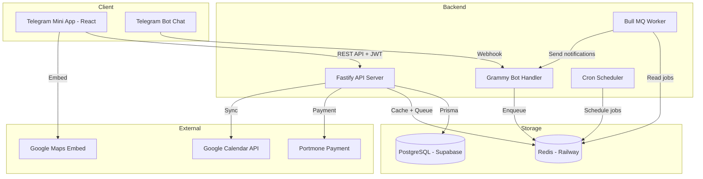
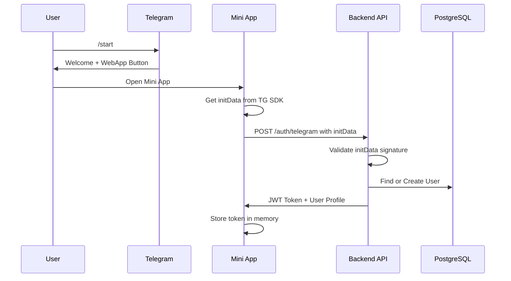
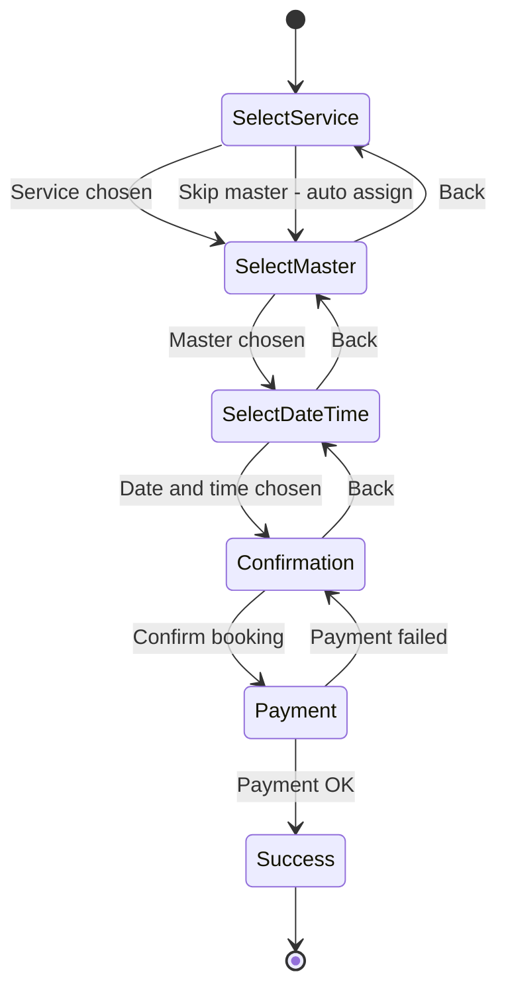
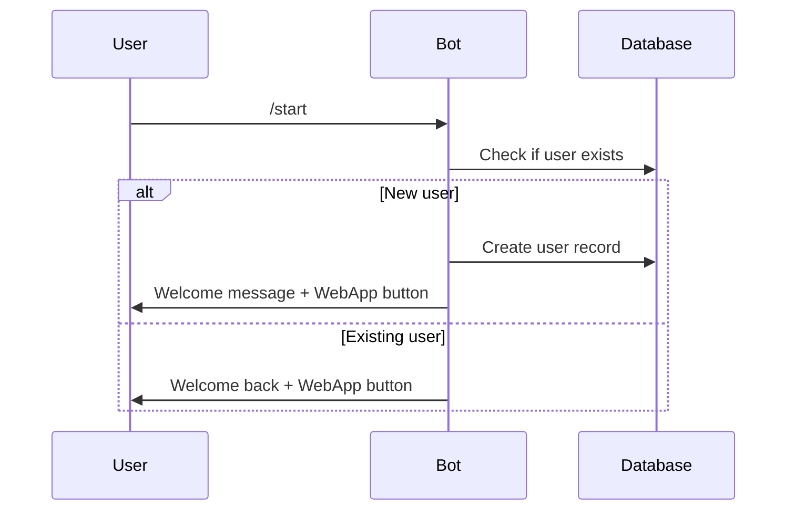
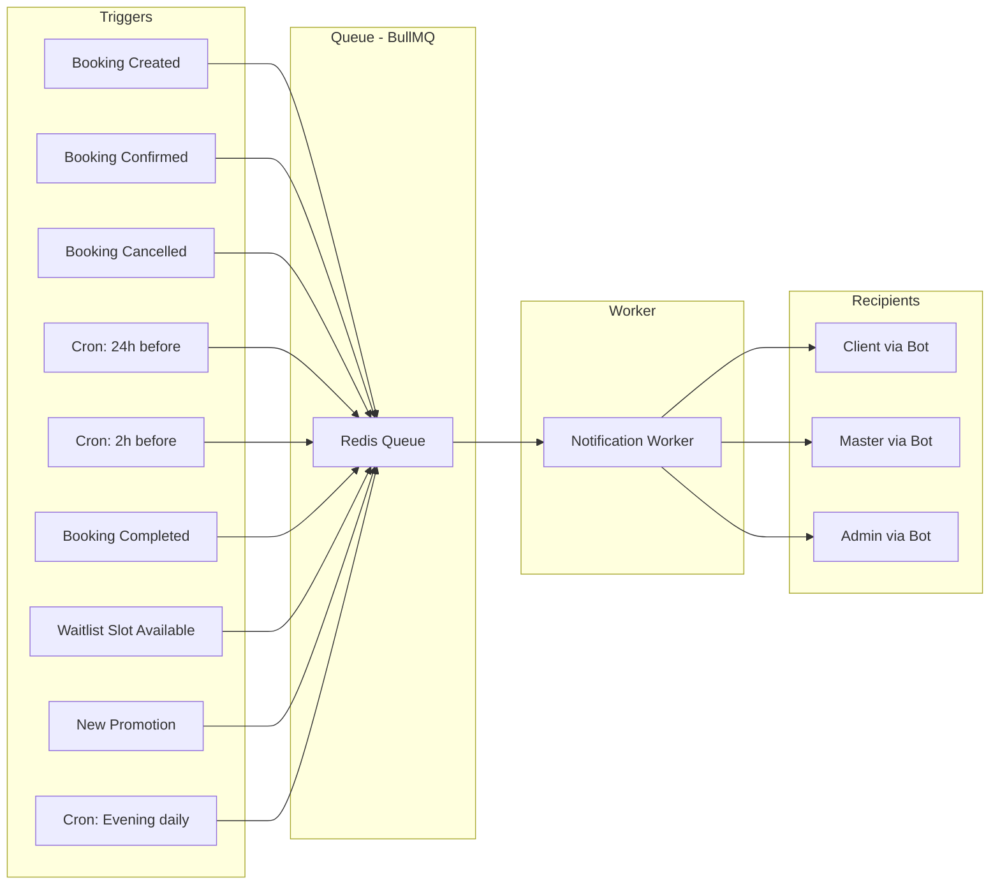
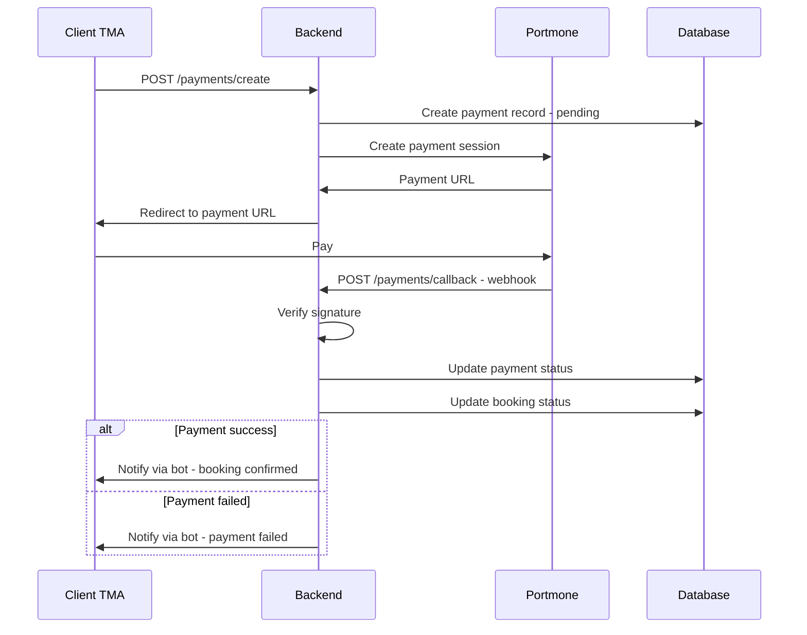
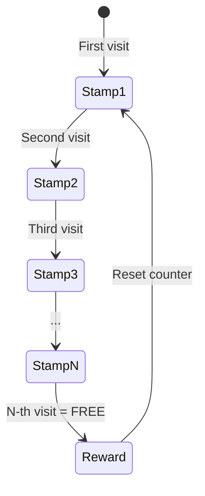
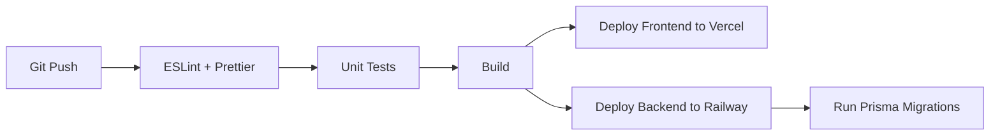

# 🏗️ Технічна архітектура: Massage Bot TMA

## 📋 Зміст
1. [Зведення вимог](#1-зведення-вимог)
2. [Технологічний стек](#2-технологічний-стек)
3. [Архітектура системи](#3-архітектура-системи)
4. [Структура БД](#4-структура-бд)
5. [Frontend архітектура](#5-frontend-архітектура)
6. [Backend архітектура](#6-backend-архітектура)
7. [Telegram Bot](#7-telegram-bot)
8. [Система сповіщень](#8-система-сповіщень)
9. [Платіжна система](#9-платіжна-система)
10. [Програма лояльності](#10-програма-лояльності)
11. [i18n — Мультимовність](#11-i18n--мультимовність)
12. [Ролі та доступ](#12-ролі-та-доступ)
13. [CI/CD та деплой](#13-cicd-та-деплой)
14. [План реалізації](#14-план-реалізації)

---

## 1. Зведення вимог

### Бізнес-параметри
| Параметр | Значення |
|----------|----------|
| Кількість майстрів | 8-15 |
| Кількість послуг | 16-30 з ієрархією категорій |
| Комбо-пакети | Так |
| Кілька послуг за візит | Так |
| Тривалість | Клієнт обирає: 30/60/90 хв |
| Графік | Гнучкий, задається на тиждень |
| Бронювання вперед | 14 днів |
| Крок часу | 15 хвилин |
| Буфер між записами | Налаштовується адміном |
| Скасування | За 2 години (налаштовується) |
| Підтвердження | Залежить від послуги |
| Онлайн-оплата | Portmone, обов'язкова передоплата |
| Депозит | Фіксований відсоток (налаштовується) |
| Ціни | Залежать від майстра |
| Промокоди | Так |
| Лояльність | Штампи: кожен N-й візит безкоштовно |
| Ролі | Власник, Адмін, Майстер, Клієнт |
| Сповіщення | Telegram Bot |
| Мови | UA/EN/RU, автовизначення |
| Навантаження | 1-10 записів/день |

---

## 2. Технологічний стек

```
┌─────────────────────────────────────────────────────┐
│                    FRONTEND                          │
│  React 18 + TypeScript + Vite                       │
│  Telegram Mini App SDK (@telegram-apps/sdk-react)   │
│  TailwindCSS + Framer Motion                        │
│  React Query (TanStack Query)                       │
│  Zustand (state management)                         │
│  react-i18next (локалізація)                        │
│  Swiper.js (каруселі)                               │
│  react-calendar / date-fns                          │
├─────────────────────────────────────────────────────┤
│                    BACKEND                           │
│  Node.js + TypeScript + Fastify                     │
│  Prisma ORM                                         │
│  Grammy (Telegram Bot Framework)                    │
│  Bull MQ (черги задач: сповіщення, cron)            │
│  Zod (валідація)                                    │
│  JWT + Telegram InitData validation                 │
├─────────────────────────────────────────────────────┤
│                   DATABASE                           │
│  PostgreSQL (Supabase / Railway)                    │
│  Redis (Bull MQ, кеш сесій)                        │
├─────────────────────────────────────────────────────┤
│                   HOSTING                            │
│  Frontend: Vercel                                   │
│  Backend: Railway                                   │
│  DB: Supabase (PostgreSQL) + Railway (Redis)        │
│  CI/CD: GitHub Actions                              │
└─────────────────────────────────────────────────────┘
```

### Обґрунтування вибору

| Технологія | Чому |
|------------|------|
| **React + Vite** | Найкраща підтримка TMA SDK, швидкий HMR, великий екосистем |
| **Fastify** | Швидший за Express у 2-3 рази, TypeScript-first, плагінна архітектура |
| **Prisma** | Type-safe ORM, автогенерація типів, міграції, чудова DX |
| **Grammy** | Сучасний TG Bot framework для Node.js, підтримка middleware |
| **TailwindCSS** | Швидка стилізація, responsive, темна тема з коробки |
| **Framer Motion** | Premium анімації для React, gesture support |
| **Zustand** | Легкий state manager, менше boilerplate ніж Redux |
| **Bull MQ** | Надійні черги для відкладених сповіщень та cron-задач |
| **Supabase** | Managed PostgreSQL, безкоштовний tier, Row Level Security |

---

## 3. Архітектура системи



### Потік автентифікації



---

## 4. Структура БД

### ER-діаграма

```mermaid
erDiagram
    users ||--o{ bookings : makes
    users ||--o{ reviews : writes
    users ||--o{ loyalty_stamps : earns
    users {
        uuid id PK
        bigint telegram_id UK
        varchar telegram_username
        varchar first_name
        varchar last_name
        varchar phone
        varchar avatar_url
        enum role
        varchar language
        boolean is_active
        timestamp created_at
        timestamp updated_at
    }

    service_categories ||--o{ service_categories : has_children
    service_categories ||--o{ services : contains
    service_categories {
        uuid id PK
        uuid parent_id FK
        jsonb name
        jsonb description
        varchar image_url
        int sort_order
        boolean is_active
    }

    services ||--o{ service_durations : has
    services ||--o{ master_services : offered_by
    services ||--o{ booking_items : booked_in
    services ||--o{ combo_items : part_of
    services {
        uuid id PK
        uuid category_id FK
        jsonb name
        jsonb description
        varchar image_url
        boolean requires_confirmation
        boolean is_active
        int sort_order
        timestamp created_at
    }

    service_durations {
        uuid id PK
        uuid service_id FK
        int duration_minutes
        decimal base_price
        boolean is_active
    }

    masters ||--o{ master_services : provides
    masters ||--o{ master_schedules : has_schedule
    masters ||--o{ bookings : serves
    masters ||--o{ reviews : receives
    masters {
        uuid id PK
        uuid user_id FK
        jsonb display_name
        jsonb bio
        varchar photo_url
        varchar specialization
        boolean is_active
        int sort_order
        timestamp created_at
    }

    master_services {
        uuid id PK
        uuid master_id FK
        uuid service_id FK
        decimal price_modifier
    }

    master_schedules {
        uuid id PK
        uuid master_id FK
        date work_date
        time start_time
        time end_time
        boolean is_day_off
    }

    combos ||--o{ combo_items : includes
    combos {
        uuid id PK
        jsonb name
        jsonb description
        varchar image_url
        decimal discount_percent
        boolean is_active
        int sort_order
    }

    combo_items {
        uuid id PK
        uuid combo_id FK
        uuid service_id FK
        uuid duration_id FK
        int sort_order
    }

    bookings ||--o{ booking_items : contains
    bookings ||--o{ payments : paid_by
    bookings ||--o{ notifications : triggers
    bookings {
        uuid id PK
        uuid user_id FK
        uuid master_id FK
        date booking_date
        time start_time
        time end_time
        enum status
        decimal total_price
        decimal deposit_amount
        decimal deposit_percent
        uuid promo_code_id FK
        decimal discount_amount
        text admin_notes
        text cancel_reason
        timestamp created_at
        timestamp updated_at
    }

    booking_items {
        uuid id PK
        uuid booking_id FK
        uuid service_id FK
        uuid duration_id FK
        decimal price
        int sort_order
    }

    payments {
        uuid id PK
        uuid booking_id FK
        uuid user_id FK
        decimal amount
        enum type
        enum status
        varchar provider_tx_id
        jsonb provider_response
        timestamp created_at
    }

    reviews {
        uuid id PK
        uuid user_id FK
        uuid master_id FK
        uuid booking_id FK
        int rating
        text comment
        enum status
        timestamp created_at
    }

    promo_codes ||--o{ bookings : applied_to
    promo_codes {
        uuid id PK
        varchar code UK
        enum discount_type
        decimal discount_value
        decimal min_order_amount
        int max_uses
        int current_uses
        timestamp valid_from
        timestamp valid_until
        boolean is_active
    }

    loyalty_stamps {
        uuid id PK
        uuid user_id FK
        uuid booking_id FK
        int stamp_number
        boolean is_reward
        timestamp created_at
    }

    loyalty_settings {
        uuid id PK
        int stamps_for_reward
        jsonb eligible_services
        boolean is_active
    }

    notifications {
        uuid id PK
        uuid user_id FK
        uuid booking_id FK
        enum type
        enum channel
        enum status
        jsonb payload
        timestamp scheduled_at
        timestamp sent_at
    }

    waitlist {
        uuid id PK
        uuid user_id FK
        uuid service_id FK
        uuid master_id FK
        date preferred_date
        time preferred_start
        time preferred_end
        enum status
        timestamp created_at
    }

    promotions {
        uuid id PK
        jsonb title
        jsonb description
        varchar image_url
        timestamp start_date
        timestamp end_date
        boolean is_active
        int sort_order
    }

    site_settings {
        uuid id PK
        varchar key UK
        jsonb value
        timestamp updated_at
    }

    google_calendar_sync {
        uuid id PK
        uuid master_id FK
        varchar google_calendar_id
        varchar refresh_token
        timestamp last_synced_at
        boolean is_active
    }
```



### Enum-типи

```sql
-- Ролі користувачів
CREATE TYPE user_role AS ENUM ('client', 'master', 'admin', 'owner');

-- Статуси бронювання
CREATE TYPE booking_status AS ENUM (
    'pending_confirmation',  -- Очікує підтвердження адміном
    'confirmed',             -- Підтверджено
    'deposit_pending',       -- Очікує оплати депозиту
    'deposit_paid',          -- Депозит оплачено
    'in_progress',           -- Виконується
    'completed',             -- Завершено
    'cancelled_by_client',   -- Скасовано клієнтом
    'cancelled_by_admin',    -- Скасовано адміном
    'no_show'                -- Клієнт не з'явився
);

-- Типи оплати
CREATE TYPE payment_type AS ENUM ('deposit', 'full', 'refund');
CREATE TYPE payment_status AS ENUM ('pending', 'success', 'failed', 'refunded');

-- Типи сповіщень
CREATE TYPE notification_type AS ENUM (
    'booking_created',
    'booking_confirmed',
    'booking_cancelled',
    'reminder_24h',
    'reminder_2h',
    'review_request',
    'promotion',
    'schedule_daily',
    'waitlist_available'
);

-- Статуси відгуків
CREATE TYPE review_status AS ENUM ('pending', 'approved', 'rejected');

-- Типи знижок
CREATE TYPE discount_type AS ENUM ('percent', 'fixed');

-- Статуси списку очікування
CREATE TYPE waitlist_status AS ENUM ('active', 'notified', 'booked', 'expired');
```

### Ключові індекси

```sql
-- Швидкий пошук вільних слотів
CREATE INDEX idx_master_schedules_date ON master_schedules(master_id, work_date);
CREATE INDEX idx_bookings_master_date ON bookings(master_id, booking_date, status);

-- Пошук користувача по Telegram ID
CREATE UNIQUE INDEX idx_users_telegram_id ON users(telegram_id);

-- Сповіщення для відправки
CREATE INDEX idx_notifications_scheduled ON notifications(scheduled_at, status);

-- Промокоди
CREATE UNIQUE INDEX idx_promo_codes_code ON promo_codes(code);
```

---

## 5. Frontend архітектура

### Структура проєкту

```
src/
├── app/
│   ├── App.tsx                    # Root component
│   ├── Router.tsx                 # React Router config
│   └── providers/
│       ├── TelegramProvider.tsx   # TMA SDK init
│       ├── AuthProvider.tsx       # JWT auth context
│       ├── QueryProvider.tsx      # React Query
│       └── I18nProvider.tsx       # i18next
├── pages/
│   ├── home/
│   │   ├── HomePage.tsx
│   │   ├── components/
│   │   │   ├── HeroSection.tsx
│   │   │   ├── AboutSection.tsx
│   │   │   ├── PromotionsCarousel.tsx
│   │   │   ├── ServicesCarousel.tsx
│   │   │   ├── MastersCarousel.tsx
│   │   │   ├── ReviewsCarousel.tsx
│   │   │   ├── GoogleMapSection.tsx
│   │   │   └── BookingCTA.tsx
│   │   └── hooks/
│   │       └── useHomeData.ts
│   ├── booking/
│   │   ├── BookingPage.tsx
│   │   ├── components/
│   │   │   ├── BookingWizard.tsx       # Step container
│   │   │   ├── ServiceStep.tsx         # Step 1: Choose service
│   │   │   ├── MasterStep.tsx          # Step 2: Choose master
│   │   │   ├── DateTimeStep.tsx        # Step 3: Date and time
│   │   │   ├── ConfirmStep.tsx         # Step 4: Summary + pay
│   │   │   ├── ServiceCard.tsx
│   │   │   ├── MasterCard.tsx
│   │   │   ├── TimeSlotGrid.tsx
│   │   │   ├── CalendarPicker.tsx
│   │   │   └── PromoCodeInput.tsx
│   │   ├── hooks/
│   │   │   ├── useBookingWizard.ts
│   │   │   ├── useAvailableSlots.ts
│   │   │   └── useCreateBooking.ts
│   │   └── store/
│   │       └── bookingStore.ts         # Zustand store
│   ├── profile/
│   │   ├── ProfilePage.tsx
│   │   ├── components/
│   │   │   ├── ProfileHeader.tsx
│   │   │   ├── ProfileForm.tsx
│   │   │   ├── LoyaltyCard.tsx
│   │   │   ├── BookingHistory.tsx
│   │   │   ├── BookingHistoryItem.tsx
│   │   │   ├── LanguageSwitcher.tsx
│   │   │   └── QuickRebook.tsx
│   │   └── hooks/
│   │       ├── useProfile.ts
│   │       └── useLoyalty.ts
│   ├── admin/
│   │   ├── AdminLayout.tsx
│   │   ├── DashboardPage.tsx
│   │   ├── services/
│   │   │   ├── ServicesListPage.tsx
│   │   │   └── ServiceFormPage.tsx
│   │   ├── masters/
│   │   │   ├── MastersListPage.tsx
│   │   │   └── MasterFormPage.tsx
│   │   ├── bookings/
│   │   │   ├── BookingsListPage.tsx
│   │   │   └── BookingDetailPage.tsx
│   │   ├── schedule/
│   │   │   └── ScheduleManagerPage.tsx
│   │   ├── content/
│   │   │   ├── PromotionsPage.tsx
│   │   │   ├── ReviewsModerationPage.tsx
│   │   │   └── SiteSettingsPage.tsx
│   │   ├── promo-codes/
│   │   │   └── PromoCodesPage.tsx
│   │   ├── loyalty/
│   │   │   └── LoyaltySettingsPage.tsx
│   │   ├── analytics/
│   │   │   └── AnalyticsPage.tsx
│   │   └── users/
│   │       └── UsersManagementPage.tsx
│   └── master/
│       ├── MasterLayout.tsx
│       ├── MasterSchedulePage.tsx
│       ├── MasterBookingsPage.tsx
│       └── MasterStatsPage.tsx
├── shared/
│   ├── api/
│   │   ├── client.ts               # Axios/fetch wrapper
│   │   ├── auth.api.ts
│   │   ├── bookings.api.ts
│   │   ├── services.api.ts
│   │   ├── masters.api.ts
│   │   ├── reviews.api.ts
│   │   ├── payments.api.ts
│   │   └── admin.api.ts
│   ├── components/
│   │   ├── ui/                     # Base UI components
│   │   │   ├── Button.tsx
│   │   │   ├── Card.tsx
│   │   │   ├── Modal.tsx
│   │   │   ├── Skeleton.tsx
│   │   │   ├── Badge.tsx
│   │   │   ├── Avatar.tsx
│   │   │   ├── StarRating.tsx
│   │   │   └── Toast.tsx
│   │   ├── layout/
│   │   │   ├── AppLayout.tsx
│   │   │   ├── BottomNav.tsx
│   │   │   └── Header.tsx
│   │   └── Carousel.tsx            # Reusable Swiper wrapper
│   ├── hooks/
│   │   ├── useTelegram.ts
│   │   ├── useAuth.ts
│   │   └── useTheme.ts
│   ├── i18n/
│   │   ├── config.ts
│   │   ├── locales/
│   │   │   ├── uk.json
│   │   │   ├── en.json
│   │   │   └── ru.json
│   │   └── useTranslatedContent.ts  # Hook for DB content
│   ├── types/
│   │   ├── user.ts
│   │   ├── service.ts
│   │   ├── booking.ts
│   │   ├── master.ts
│   │   └── api.ts
│   └── utils/
│       ├── date.ts
│       ├── price.ts
│       └── validation.ts
└── assets/
    ├── icons/
    └── images/
```

### Роутинг

```typescript
// Router.tsx
const routes = [
  // Публічні сторінки
  { path: '/',           element: <HomePage /> },
  { path: '/booking',    element: <BookingPage /> },
  { path: '/profile',    element: <ProfilePage />,    auth: 'client' },

  // Панель майстра
  { path: '/master',           element: <MasterLayout />,    auth: 'master' },
  { path: '/master/schedule',  element: <MasterSchedulePage /> },
  { path: '/master/bookings',  element: <MasterBookingsPage /> },
  { path: '/master/stats',     element: <MasterStatsPage /> },

  // Адмін-панель
  { path: '/admin',              element: <AdminLayout />,     auth: 'admin' },
  { path: '/admin/dashboard',    element: <DashboardPage /> },
  { path: '/admin/services',     element: <ServicesListPage /> },
  { path: '/admin/masters',      element: <MastersListPage /> },
  { path: '/admin/bookings',     element: <BookingsListPage /> },
  { path: '/admin/schedule',     element: <ScheduleManagerPage /> },
  { path: '/admin/promotions',   element: <PromotionsPage /> },
  { path: '/admin/reviews',      element: <ReviewsModerationPage /> },
  { path: '/admin/promo-codes',  element: <PromoCodesPage /> },
  { path: '/admin/loyalty',      element: <LoyaltySettingsPage /> },
  { path: '/admin/analytics',    element: <AnalyticsPage /> },
  { path: '/admin/settings',     element: <SiteSettingsPage /> },
  { path: '/admin/users',        element: <UsersManagementPage /> },
];
```

### Ключові компоненти

#### BookingWizard — Потік бронювання



#### Каруселі на головній

Всі 4 каруселі використовують спільний компонент `Carousel.tsx` на базі Swiper.js:
- **Акції** — горизонтальний слайдер з великими банерами, autoplay
- **Послуги** — картки з іконкою, назвою, ціною від
- **Персонал** — фото, ім'я, спеціалізація, рейтинг
- **Відгуки** — аватар клієнта, зірки, текст, дата

#### Система тем

TMA автоматично отримує тему від Telegram (light/dark). Використовуємо CSS-змінні Telegram + TailwindCSS dark mode.

---

## 6. Backend архітектура

### Структура проєкту

```
server/
├── src/
│   ├── app.ts                      # Fastify app init
│   ├── server.ts                   # Entry point
│   ├── config/
│   │   ├── env.ts                  # Environment variables
│   │   ├── database.ts             # Prisma client
│   │   └── redis.ts                # Redis connection
│   ├── modules/
│   │   ├── auth/
│   │   │   ├── auth.controller.ts
│   │   │   ├── auth.service.ts
│   │   │   ├── auth.schema.ts      # Zod schemas
│   │   │   └── telegram.guard.ts   # InitData validation
│   │   ├── users/
│   │   │   ├── users.controller.ts
│   │   │   ├── users.service.ts
│   │   │   └── users.schema.ts
│   │   ├── services/
│   │   │   ├── services.controller.ts
│   │   │   ├── services.service.ts
│   │   │   └── services.schema.ts
│   │   ├── masters/
│   │   │   ├── masters.controller.ts
│   │   │   ├── masters.service.ts
│   │   │   └── masters.schema.ts
│   │   ├── bookings/
│   │   │   ├── bookings.controller.ts
│   │   │   ├── bookings.service.ts
│   │   │   ├── bookings.schema.ts
│   │   │   └── slots.service.ts    # Available slots logic
│   │   ├── payments/
│   │   │   ├── payments.controller.ts
│   │   │   ├── payments.service.ts
│   │   │   └── portmone.client.ts
│   │   ├── reviews/
│   │   │   ├── reviews.controller.ts
│   │   │   └── reviews.service.ts
│   │   ├── loyalty/
│   │   │   ├── loyalty.controller.ts
│   │   │   └── loyalty.service.ts
│   │   ├── promo-codes/
│   │   │   ├── promo.controller.ts
│   │   │   └── promo.service.ts
│   │   ├── waitlist/
│   │   │   ├── waitlist.controller.ts
│   │   │   └── waitlist.service.ts
│   │   ├── notifications/
│   │   │   ├── notifications.service.ts
│   │   │   ├── notifications.worker.ts  # Bull MQ worker
│   │   │   └── templates/
│   │   │       ├── booking-created.ts
│   │   │       ├── booking-confirmed.ts
│   │   │       ├── reminder.ts
│   │   │       └── review-request.ts
│   │   ├── admin/
│   │   │   ├── admin.controller.ts
│   │   │   ├── admin.service.ts
│   │   │   ├── analytics.service.ts
│   │   │   └── settings.service.ts
│   │   └── calendar/
│   │       ├── gcal.controller.ts
│   │       └── gcal.service.ts
│   ├── bot/
│   │   ├── bot.ts                  # Grammy bot init
│   │   ├── commands/
│   │   │   └── start.ts
│   │   ├── handlers/
│   │   │   └── callback.ts
│   │   └── middleware/
│   │       └── auth.ts
│   ├── jobs/
│   │   ├── scheduler.ts            # Cron jobs setup
│   │   ├── reminder.job.ts
│   │   ├── daily-schedule.job.ts
│   │   ├── review-request.job.ts
│   │   └── waitlist-check.job.ts
│   ├── shared/
│   │   ├── middleware/
│   │   │   ├── auth.middleware.ts
│   │   │   ├── role.middleware.ts
│   │   │   └── error.middleware.ts
│   │   ├── utils/
│   │   │   ├── crypto.ts
│   │   │   ├── date.ts
│   │   │   └── pagination.ts
│   │   └── types/
│   │       └── index.ts
│   └── prisma/
│       ├── schema.prisma
│       ├── migrations/
│       └── seed.ts
├── package.json
├── tsconfig.json
└── .env.example
```

### API Endpoints

#### Auth
| Method | Path | Опис | Доступ |
|--------|------|------|--------|
| POST | `/api/auth/telegram` | Автентифікація через TG initData | Public |
| GET | `/api/auth/me` | Поточний користувач | Auth |

#### Services
| Method | Path | Опис | Доступ |
|--------|------|------|--------|
| GET | `/api/services` | Список послуг з категоріями | Public |
| GET | `/api/services/:id` | Деталі послуги | Public |
| GET | `/api/services/categories` | Дерево категорій | Public |
| GET | `/api/combos` | Список комбо-пакетів | Public |
| POST | `/api/admin/services` | Створити послугу | Admin |
| PUT | `/api/admin/services/:id` | Оновити послугу | Admin |
| DELETE | `/api/admin/services/:id` | Видалити послугу | Admin |

#### Masters
| Method | Path | Опис | Доступ |
|--------|------|------|--------|
| GET | `/api/masters` | Список майстрів | Public |
| GET | `/api/masters/:id` | Профіль майстра | Public |
| GET | `/api/masters/:id/services` | Послуги майстра | Public |
| GET | `/api/masters/:id/reviews` | Відгуки про майстра | Public |
| GET | `/api/masters/available` | Вільні майстри для послуги | Public |

#### Bookings
| Method | Path | Опис | Доступ |
|--------|------|------|--------|
| GET | `/api/bookings/slots` | Вільні слоти | Auth |
| POST | `/api/bookings` | Створити бронювання | Auth |
| GET | `/api/bookings/my` | Мої бронювання | Auth |
| GET | `/api/bookings/:id` | Деталі бронювання | Auth |
| POST | `/api/bookings/:id/cancel` | Скасувати | Auth |
| POST | `/api/bookings/:id/rebook` | Повторний запис | Auth |
| PUT | `/api/admin/bookings/:id` | Оновити статус | Admin |
| GET | `/api/master/bookings` | Записи майстра | Master |
| POST | `/api/master/bookings/:id/complete` | Відмітити виконано | Master |
| POST | `/api/master/bookings/:id/no-show` | Відмітити не з'явився | Master |

#### Payments
| Method | Path | Опис | Доступ |
|--------|------|------|--------|
| POST | `/api/payments/create` | Ініціювати оплату | Auth |
| POST | `/api/payments/callback` | Webhook від Portmone | Public |
| GET | `/api/payments/:id/status` | Статус оплати | Auth |

#### Reviews
| Method | Path | Опис | Доступ |
|--------|------|------|--------|
| POST | `/api/reviews` | Залишити відгук | Auth |
| GET | `/api/reviews` | Список відгуків (для головної) | Public |
| PUT | `/api/admin/reviews/:id` | Модерація відгуку | Admin |

#### Profile
| Method | Path | Опис | Доступ |
|--------|------|------|--------|
| GET | `/api/profile` | Мій профіль | Auth |
| PUT | `/api/profile` | Оновити профіль | Auth |
| GET | `/api/profile/loyalty` | Мої штампи лояльності | Auth |

#### Promo Codes
| Method | Path | Опис | Доступ |
|--------|------|------|--------|
| POST | `/api/promo-codes/validate` | Перевірити промокод | Auth |
| GET | `/api/admin/promo-codes` | Список промокодів | Admin |
| POST | `/api/admin/promo-codes` | Створити промокод | Admin |

#### Waitlist
| Method | Path | Опис | Доступ |
|--------|------|------|--------|
| POST | `/api/waitlist` | Додати в список очікування | Auth |
| GET | `/api/waitlist/my` | Мої записи в очікуванні | Auth |
| DELETE | `/api/waitlist/:id` | Видалити з очікування | Auth |

#### Admin
| Method | Path | Опис | Доступ |
|--------|------|------|--------|
| GET | `/api/admin/analytics` | Аналітика | Admin |
| GET | `/api/admin/settings` | Налаштування сайту | Admin |
| PUT | `/api/admin/settings` | Оновити налаштування | Admin |
| GET | `/api/admin/users` | Список користувачів | Admin |
| PUT | `/api/admin/users/:id/role` | Змінити роль | Owner |

#### Schedule
| Method | Path | Опис | Доступ |
|--------|------|------|--------|
| GET | `/api/master/schedule` | Мій розклад | Master |
| GET | `/api/admin/schedule/:masterId` | Розклад майстра | Admin |
| PUT | `/api/admin/schedule/:masterId` | Оновити розклад | Admin |

#### Google Calendar
| Method | Path | Опис | Доступ |
|--------|------|------|--------|
| POST | `/api/master/calendar/connect` | Підключити GCal | Master |
| POST | `/api/master/calendar/sync` | Синхронізувати | Master |
| DELETE | `/api/master/calendar/disconnect` | Відключити | Master |

---

## 7. Telegram Bot

### Команди та обробники

```
/start — Привітання + кнопка "Увійти" (WebApp)
```

### Потік /start



### Inline кнопки бота

Бот використовується переважно для:
1. Точка входу — кнопка WebApp
2. Сповіщення — нагадування, підтвердження, запити на відгук
3. Callback-кнопки в сповіщеннях (підтвердити/скасувати запис)

---

## 8. Система сповіщень

### Типи сповіщень та тригери



### Розклад Cron-задач

| Задача | Розклад | Опис |
|--------|---------|------|
| Нагадування 24г | Щогодини | Знайти записи через 24г, відправити нагадування |
| Нагадування 2г | Кожні 15 хв | Знайти записи через 2г, відправити нагадування |
| Запит відгуку | Щогодини | Знайти завершені записи без відгуку (через 2г після) |
| Розклад на завтра | 20:00 щодня | Відправити майстрам розклад на завтра |
| Перевірка waitlist | Кожні 30 хв | Перевірити чи з'явились вільні слоти |
| Щоденний звіт адміну | 21:00 щодня | Статистика за день |

---

## 9. Платіжна система

### Потік оплати через Portmone



### Налаштування депозиту

- Відсоток депозиту зберігається в `site_settings` (ключ: `deposit_percent`)
- За замовчуванням: 50%
- Адмін може змінити через адмін-панель
- При створенні бронювання: `deposit_amount = total_price * deposit_percent / 100`

---

## 10. Програма лояльності

### Логіка штампів



- N задається в `loyalty_settings.stamps_for_reward`
- Штамп нараховується після статусу `completed`
- Безкоштовна послуга — тільки з переліку `eligible_services`
- Адмін керує налаштуваннями через панель

---

## 11. i18n — Мультимовність

### Підхід

1. **Інтерфейс** — статичні переклади через `react-i18next` (файли `uk.json`, `en.json`, `ru.json`)
2. **Контент з БД** — поля `name`, `description` зберігаються як JSONB:
   ```json
   {
     "uk": "Класичний масаж",
     "en": "Classic massage",
     "ru": "Классический массаж"
   }
   ```
3. **Визначення мови** — з `Telegram.WebApp.initDataUnsafe.user.language_code`
4. **Перемикач** — в профілі, зберігається в `users.language`

### Хук для контенту з БД

```typescript
// useTranslatedContent.ts
function useTranslatedContent<T>(content: Record<string, T>): T {
  const { i18n } = useTranslation();
  const lang = i18n.language; // 'uk' | 'en' | 'ru'
  return content[lang] || content['uk']; // fallback to Ukrainian
}
```

---

## 12. Ролі та доступ

### Матриця доступу

| Функція | Client | Master | Admin | Owner |
|---------|--------|--------|-------|-------|
| Перегляд послуг | ✅ | ✅ | ✅ | ✅ |
| Бронювання | ✅ | ✅ | ✅ | ✅ |
| Свій профіль | ✅ | ✅ | ✅ | ✅ |
| Свій розклад | ❌ | ✅ | ❌ | ❌ |
| Відмітка виконано | ❌ | ✅ | ✅ | ✅ |
| Своя статистика | ❌ | ✅ | ❌ | ❌ |
| Google Calendar sync | ❌ | ✅ | ❌ | ❌ |
| CRUD послуг | ❌ | ❌ | ✅ | ✅ |
| CRUD майстрів | ❌ | ❌ | ✅ | ✅ |
| Управління розкладом | ❌ | ❌ | ✅ | ✅ |
| Управління контентом | ❌ | ❌ | ✅ | ✅ |
| Модерація відгуків | ❌ | ❌ | ✅ | ✅ |
| Промокоди | ❌ | ❌ | ✅ | ✅ |
| Лояльність | ❌ | ❌ | ✅ | ✅ |
| Аналітика | ❌ | ❌ | ✅ | ✅ |
| Налаштування сайту | ❌ | ❌ | ✅ | ✅ |
| Управління адмінами | ❌ | ❌ | ❌ | ✅ |
| Фінансові звіти | ❌ | ❌ | ❌ | ✅ |

---

## 13. CI/CD та деплой

### GitHub Actions Pipeline



### Середовища

| Середовище | Frontend | Backend | DB |
|------------|----------|---------|-----|
| Development | localhost:5173 | localhost:3000 | Local PostgreSQL |
| Staging | staging.vercel.app | staging.railway.app | Supabase staging |
| Production | prod.vercel.app | prod.railway.app | Supabase production |

---
